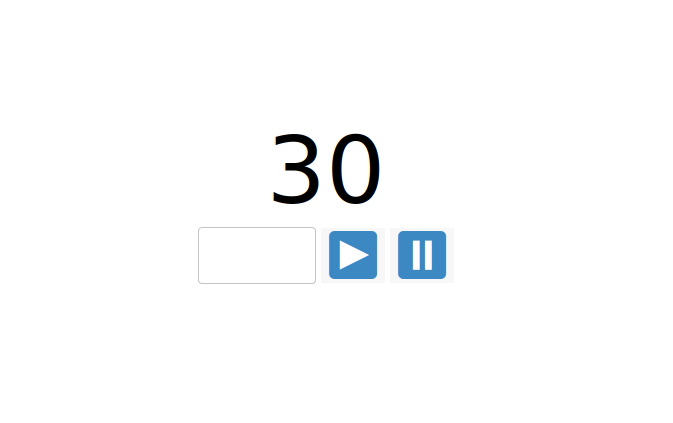

# Server Sent Events with an ASP.Net Core backend

A small example on using HTML Server Sent Events in a ASP.Net core web API.

## Remote counter

The application is a counter which increases automatically every second.
The user can pause or resume the counter, or set it to a given value.

The counter is stored in memory on the server. Changes in a browser session will be propagated to all other open sessions.

## Server Sent Events

[Server Sent Events](https://developer.mozilla.org/en-US/docs/Web/API/Server-sent_events)
is a Web API that allows you to push messages from a server to JavaScript
using HTTP Streams.

This is not the only way to push messages from a server,
but it is certainly an easy one and also quite elegant.

The Javascript code that consumes the server sent events is in the file
[stream.js](wwwroot/js/stream.js) and looks as follows:

    function readStream()
    {
        const evtSource = new EventSource('/Counter/Stream');
        evtSource.onmessage = function(event) {
            const el = document.getElementById('counter');
            const { value } = JSON.parse(event.data);
            
            el.textContent = value;
        }
    }

## ASP.Net Core backend

This repository contains a small self-contained web-application
that can be used a reference or as boilerplate code,
for using server sent events with ASP.Net Core backend.

The implementation of the HTTP streaming endpoint can be found in
[CounterController.cs](Controller/CounterController.cs) and looks as follows.
It is adapted from
[this StackOverflow answer](https://stackoverflow.com/a/58565850/785542).

    [HttpGet]
    [Route("Stream")]
    public async Task StreamCounter(CancellationToken cancellationToken)
    {
        _logger.LogInformation("Start counter streaming.");

        Response.StatusCode = 200;
        Response.Headers.Add("Content-Type", "text/event-stream");

        _counter.CounterUpdated += StreamValue;

        while (!cancellationToken.IsCancellationRequested) {
            await Task.Delay(1000);
        }

        _counter.CounterUpdated -= StreamValue;
        _logger.LogInformation("Stop counter streaming.");

        async void StreamValue(object sender, int value)
        {
            var messageJson = JsonConvert.SerializeObject(_counter, _jsonSettings);
            await Response.WriteAsync($"data:{messageJson}\n\n");
            await Response.Body.FlushAsync();
        }
    }

The state (counter) is stored in the [singleton service](https://docs.microsoft.com/en-us/aspnet/core/fundamentals/dependency-injection?view=aspnetcore-5.0) [PersistentCounter](Models/PersistentCounter.cs).

The service triggers an event each time the counter value is updated.
The controller subscribes to this event and pushes
the new value to the client after each change.

## How to run

To run the application simply type the following commands
in the main folder of the repository:

    dotnet build
    dotnet run

Make sure you installed the [.NET 5 SDK](https://dotnet.microsoft.com/download) before.

Open a browser and navigate to `https://localhost:5001`.

You will get a certificate error, since I'm not using a valid registered certificate.

## Motivation

The following is just some background information which provides some context.
You don't need to read it to understand the code.

### Porting a desktop application to the web

This repository is a small part of a proof of concept on how to port
an existing desktop application to a web application.

Using ASP.Net for the frontend would probably be the easiest way to do it.
However, I really like React/Redux for web development and I also am more
experienced with it than with ASP.
So I decided to use ASP for the REST Backend and to use React for the frontend.

Idiomatic .Net application make a huge use of the
[event pattern](https://docs.microsoft.com/en-us/dotnet/csharp/modern-events).

My idea is to write some kind of middleware, which subscribes to all
events produced inside the application, serializes them to JSON,
and push them to the client using *Server Sent Events*.

The client will react to the events by dispatching some Redux actions,
which will update the frontend state.

The backend will expose REST endpoints for all the other interactions
with the frontend. Nothing special about that.

The middleware will play the same role as the singleton service
[PersistentCounter](Models/PersistentCounter.cs) in this repository.

This repository uses only plain vanilla JavaScript. No React or Redux.
My purpose here is only to evaluate pushing messages through HTTP streams.
The frontend is not relevant.
